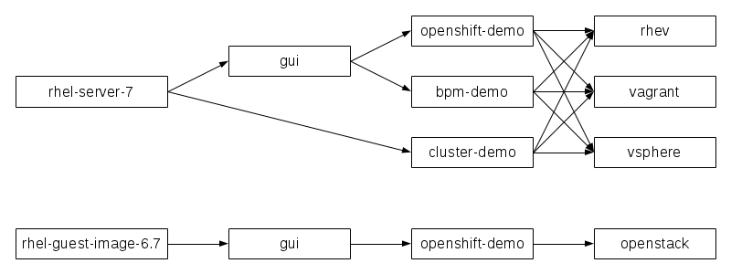

# What is Demobuilder?

### Introduction

The concept of Demobuilder is similar to a virtual machine-based version of `docker build`.  Demobuilder automates the build process of final packaged VM images by applying multiple successive scripted *layers* to specialise and increase the capability of one or more *base layers*.

Demobuilder is able to use pre-built VM images as base layers, or it can provision its own new base layers using technologies such as kickstart.  Zero or more *intermediate layers* may be added on top of a base layer, each child layer providing additional functionality in the resulting *stack*.  Lastly, one or more *target layers* are applied to the stack, thus creating one or more final portable optimised virtual machine images, each targeted to a specific hypervisor technology.

Demobuilder uses snapshots and copy-on-write technology to allow any given layer to be a "parent" to multiple "child" layers during the build process.  This maximises time and space efficiency during build, and by encouraging DRY ("don't repeat yourself") principles promotes collaboration as well as improving uniformity and manageability of resulting VM images.

Demobuilder provides tooling to facilitate efficient local development, test and sharing of layers and images based on the open source model.  It also integrates with continuous integration systems and target hypervisor platforms enabling automated build/deploy processes to be implemented.

### Syntax

A VM stack is denoted by multiple layers separated by colons in the form *base-layer:intermediate-layer\*:target-layer*.  For example, *rhel-server-7.1:gui:ose-3.0:vagrant-libvirt* denotes a stack which built from the "rhel-server-7.1" base layer with the "gui" and "ose-3.0" layers applied to it, and targeted to vagrant-libvirt using the "vagrant-libvirt" layer.

### Example

Diagram 1 demonstrates the concept of reuse of multiple base, intermediate and finalizing layers to produce a set of final VM images.  RHEV, Vagrant and VMware vSphere images are created for each of three demo images (*openshift-demo*, *bpm-demo* and *cluster-demo*).  Two of the demos (*openshift-demo* and *bpm-demo*) use a shared intermediate layer to provide a standardised graphical user interface.  Separately, a further VM image of *openshift-demo* targeted for OpenStack is also created, using a different set of intermediate layers.

In this example, each of the layers would be defined in a separate subdirectory of layers/, for example *layers/rhel-server-7*, *layers/rhel-server-7:gui*, *layers/rhel-server-7:gui:openshift-demo*, etc.  Target layers are defined under targets/, for example *targets/rhev*, *targets/vsphere*, etc.  A stack is created by running build.py with the full name of the stack, e.g. `build.py rhel-server-7:gui:openshift-demo:rhev`.  The completed file is placed in releases/.
